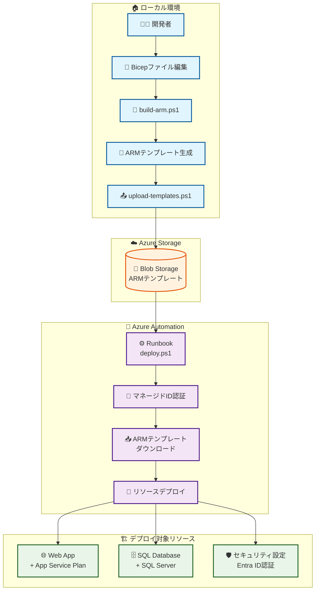
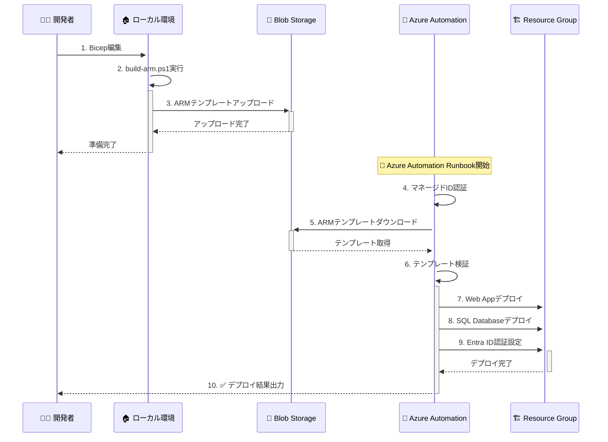
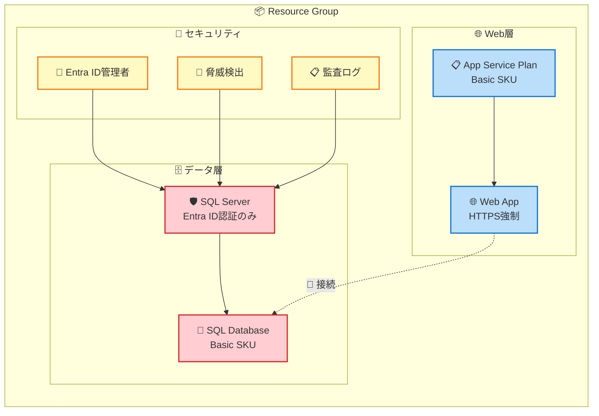
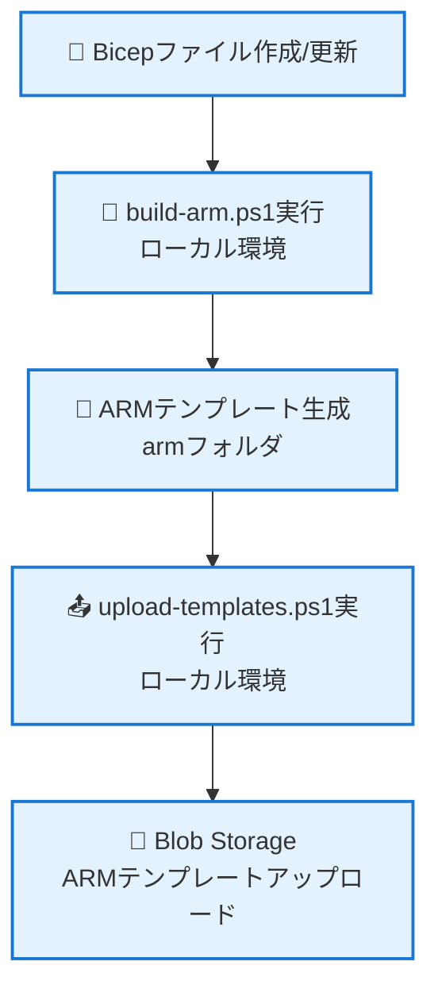
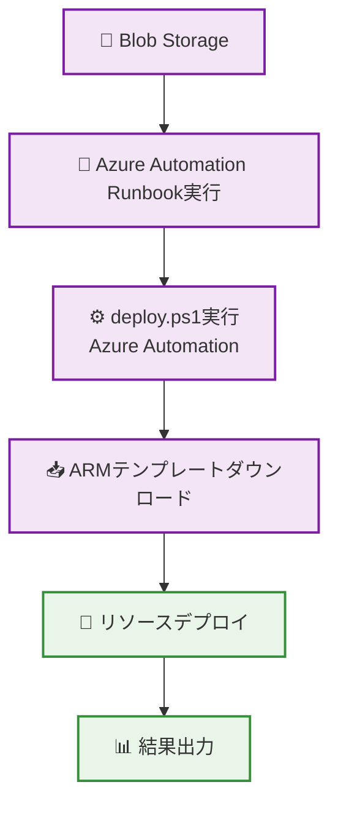

# Azure Infrastructure as Code (IaC) 自動化プロジェクト

Azure Automationで事前変換済みのARMテンプレートを使用してAzure Web AppとSQL Databaseをデプロイするためのソリューションです。

**重要**: Azure AutomationではBicep CLIが利用できないため、ARMテンプレートは事前にローカル環境で変換してからアップロードする必要があります。

## 📁 プロジェクト構造

```
automation-iac/
├── deploy.ps1                 # メインデプロイスクリプト（Azure Automation用・ARM専用）
├── build-arm.ps1              # Bicep→ARM変換スクリプト（ローカル実行用）
├── upload-templates.ps1       # ARMテンプレートアップロードスクリプト
├── test-deployment.ps1        # デプロイ設定検証テストスクリプト
├── README.md
├── infra/                     # Bicepテンプレート（ソース）
│   ├── main.bicep            # メインテンプレート
│   ├── webApp.bicep          # Web Appモジュール
│   ├── sqlDatabase.bicep     # SQL Databaseモジュール（Entra ID認証）
│   └── README.md             # Bicep用ドキュメント
└── arm/                      # 生成されたARMテンプレート
    ├── main.json             # メインテンプレート
    ├── webApp.json           # Web Appモジュール
    ├── sqlDatabase.json      # SQL Databaseモジュール
    └── README.md             # ARM用ドキュメント
```

## 🚀 使用方法

### 1. ローカル環境での準備（事前変換）

```powershell
# 0. デプロイ設定の検証テスト
.\test-deployment.ps1

# 1. BicepファイルからARMテンプレートを生成（ローカル環境で実行）
.\build-arm.ps1 -CleanOutput

# 2. Azure Blob StorageにARMテンプレートをアップロード
.\upload-templates.ps1 `
    -StorageAccountResourceGroupName "myStorageRG" `
    -StorageAccountName "mystorageaccount" `
    -ContainerName "templates" `
    -UploadArmFiles
```

### 2. Azure Automationでのデプロイ（ARMテンプレート使用）

#### デプロイ実行

```powershell
# Azure AutomationのRunbookで実行
# 事前変換済みのARMテンプレートを使用してデプロイ実行
.\deploy.ps1 `
    -ResourceGroupName "myResourceGroup" `
    -StorageAccountResourceGroupName "myStorageRG" `
    -StorageAccountName "mystorageaccount" `
    -StorageContainerName "templates" `    
    -SqlAdminEntraObjectId "12345678-1234-1234-1234-123456789012" `
    -SQLAdminEntraUPN "admin@contoso.com"
```
## 🔧 主な機能

### セキュリティ強化
- **Entra ID認証のみ**: SQL ServerでSQL認証を無効化し、Entra ID認証のみを使用
- **HTTPS強制**: Web AppでHTTPS通信とTLS 1.2の強制
- **パブリックアクセス制限**: Web AppとSQL Serverの外部アクセスを制限
- **マネージドID認証**: Azure Automationでセキュアな認証を使用
- **脅威検出**: SQL Serverで高度脅威保護を有効化

### 自動化プロセス
1. **ARMテンプレートダウンロード**: Blob StorageからARMテンプレートを取得
2. **テンプレート検証**: メインテンプレートの存在確認
3. **デプロイ実行**: ARMテンプレートでリソースをデプロイ
4. **結果出力**: Web AppとSQL Serverの接続情報を表示

### エラーハンドリング
- リソースグループ存在確認
- ARMテンプレートファイルの存在チェック
- デプロイメントエラーの詳細出力
- 一時ファイルの自動クリーンアップ

## 📋 前提条件

### Azure環境
- Azure Automation アカウント（PowerShell 7 Runbook 推奨）
- Azure Storage Account（テンプレート保存用）
- 適切な権限を持つマネージドID

### 必要なモジュール
- Bicep CLI（ローカル環境でのARM変換用のみ）

### 権限設定
- **マネージドID**: デプロイ先リソースグループのContributor権限
- **Storage Account**: Storage Blob Data Reader権限

## 🏗️ アーキテクチャ図


### システム全体構成

**テキスト版アーキテクチャ:**
```
🏠 ローカル環境                    ☁️ Azure Storage                🤖 Azure Automation
┌─────────────────────┐          ┌─────────────────┐           ┌──────────────────────┐
│ 👨‍💻 開発者           │          │ 💾 Blob Storage │           │ ⚙️ Runbook (deploy.ps1) │
│  ↓                  │          │ ARMテンプレート  │    ───────│  ↓                   │
│ 📝 Bicepファイル編集 │         │                  │           │ 🔐 マネージドID認証  │
│  ↓                  │   ────── │                 │           │  ↓                   │
│ 🔧 build-arm.ps1   │          │                 │           │ 📥 テンプレート       │
│  ↓                  │          │                 │           │    ダウンロード       │
│ 📄 ARMテンプレート生成│         │                 │           │  ↓                   │
│  ↓                  │          │                 │           │ 🚀 リソースデプロ     │
│ 📤 upload-templates │         │                 │           └──────────────────────┘
└─────────────────────┘          └─────────────────┘                      ↓
                                                              🏗️ デプロイ対象リソース
                                                              ┌─────────────────────┐
                                                              │ 🌐 Web App          │
                                                              │ 🗄️ SQL Database     │
                                                              │ 🛡️ セキュリティ設定  │
                                                              └─────────────────────┘
```

### システム全体構成


### Azure Automationデプロイフロー


### デプロイされるリソース構成


## 🔄 ワークフロー詳細

### 1. 開発フェーズ（ローカル環境）


### 2. デプロイフェーズ（Azure Automation）


## 📝 パラメーター

### deploy.ps1（メインスクリプト）
| パラメーター | 必須 | 説明 | デフォルト値 |
|------------|------|------|------------|
| `ResourceGroupName` | ✓ | デプロイ先リソースグループ | - |
| `StorageAccountResourceGroupName` | ✓ | ストレージアカウントのリソースグループ | - |
| `StorageAccountName` | ✓ | テンプレート保存先ストレージアカウント | - |
| `StorageContainerName` | ✓ | テンプレート保存先コンテナ | - |
| `SqlAdminEntraObjectId` | ✓ | SQL Server管理者のEntra ID オブジェクトID | - |
| `SQLAdminEntraUPN` | ✓ | SQL Server管理者のEntra IDログイン名（UPN） | - |
| `MainTemplateFileName` | - | メインARMテンプレートファイル名 | `main.json` |

### デプロイされるリソース
- **Azure Web App**: Basic SKUのApp Service Plan上で実行
- **Azure SQL Database**: Basic SKU、Entra ID認証のみ、パブリックアクセス無効
- **セキュリティ設定**: IP制限、SSL強制、Azure AD統合認証

## ⚠️ 重要な制約事項

### Azure Automationの制約
- **Bicep CLI非対応**: Azure AutomationではBicep CLIが利用できません
- **事前変換必須**: ARMテンプレートは必ずローカル環境で事前変換してください
- **JSONファイルのみ**: deploy.ps1は*.jsonファイルのみを処理します

### ワークフロー制約
1. **ローカル環境**: Bicep→ARM変換とアップロード
2. **Azure Automation**: ARMテンプレートによるデプロイのみ

## 🔐 Entra ID認証設定

### 必要な権限
SQL Server管理者として指定するEntra IDユーザーは以下の権限が必要です：
- リソースグループまたはサブスクリプションの`SQL DB Contributor`ロール
- または `Microsoft.Sql/*` 権限を持つカスタムロール

### 設定手順
1. Azure PortalまたはPowerShellでEntra ID管理者のObject IDとUPNを取得
2. `deploy.ps1`の実行時に適切なパラメーターを指定：
   ```powershell
   -SqlAdminEntraObjectId "YOUR_ADMIN_OBJECT_ID"
   -SQLAdminEntraUPN "YOUR_ADMIN_EMAIL"
   ```
3. デプロイ実行

### 接続方法
デプロイ後のSQL Serverへの接続：
- **Azure Portal**: Azure AD認証を使用
- **SQL Server Management Studio**: Azure Active Directory認証を選択
- **接続文字列**: `Server=your-server.database.windows.net;Authentication=Active Directory Integrated;`

## 🛡️ セキュリティ考慮事項

1. **Entra ID統合**: SQL認証を無効化してAzure AD認証のみを使用
2. **最小権限**: RBACで必要最小限の権限のみ付与
3. **ネットワーク分離**: パブリックアクセスの制限
4. **監査ログ**: Automation実行ログの定期確認
5. **管理者権限**: Entra ID管理者の適切な権限設定と定期レビュー

## 📚 関連ドキュメント

- [infra/README.md](./infra/README.md) - Bicepテンプレートの詳細
- [arm/README.md](./arm/README.md) - ARMテンプレートの詳細
- [Azure Automation Documentation](https://docs.microsoft.com/ja-jp/azure/automation/)
- [Bicep Documentation](https://docs.microsoft.com/ja-jp/azure/azure-resource-manager/bicep/)

---
*最終更新: 2025年5月28日*